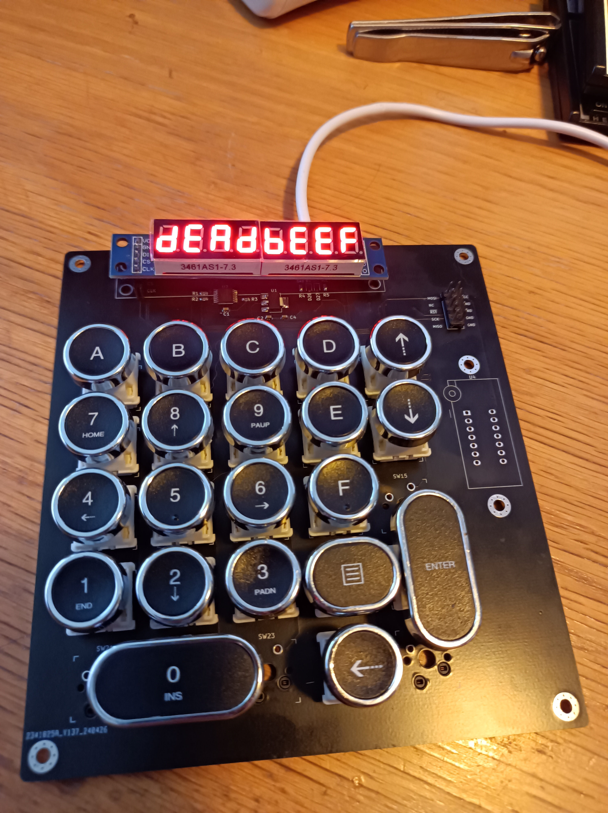
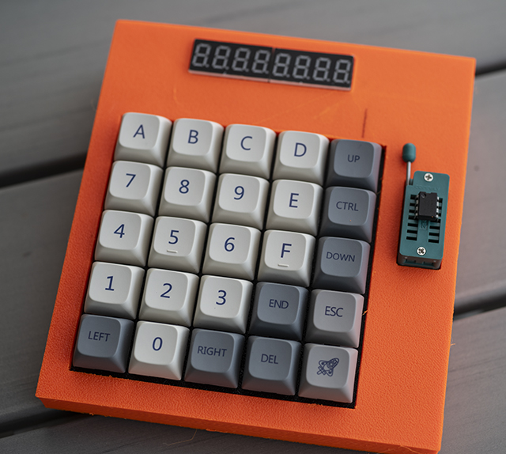

# HexKeyboard

The matrix rows are on pin 4, 12, 6, 7, 23
The matrix columns are on pin 22, 21, 20, 19, 18

The SD card holder is connected to SPI, plus
Card Detect = PB0 / pin 17
Chip Enable = PB4 / pin 8
Note that CD is connected to the RXLED pin, so it will probably collide with serial data.

The display is connected like this:

* CLK = 9
* CS = 10
* DIN = 11

This requires a local max7219.h with the defines modified. Just copty 

### Serial LED pins
If you want to eliminate problems with the two LED pins (see above), you can always just disable the entire functionality, by modifying USBCore.cpp (probably found here: _C:\Users\Yourname\AppData\Local\Arduino15\packages\arduino\hardware\avr\1.8.6\cores\arduino_).

Just comment out everything to do with RXLED and TXLED, and the file will be recompiled upon the next build.

### Misc
The SPI pins for the MAX7219 display aren't actually SPI pins. Still, the max7219 library just bit-bangs the protocol so it doesn't really matter.

If you add an ESP-01/ESP-01S (with the Espressif "AT" firmware, for instance), set it to use 9600 baud
on the serial interface. The default 115200 baud seems a bit too fast.

If you print the case, and want a LED indicator for the ESP-01, print out the included wifiSign model on
a resin printer using transparent resin, then drill a 3.5mm hole roughly 3.7mm below the lower edge of the
display and 13mm to the right of the right edge of the display, insert the transparent plug, and then pour black resin carefully around the symbol (preferably using a syringe and microscope) and cure it with a UV
light.
